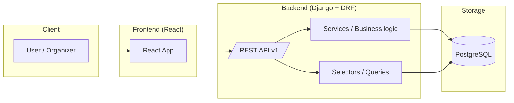

# Delux (MVP)

Delux — учебный MVP-проект для **организации спортивных мероприятий** (online/offline, платные/бесплатные) и **маркетплейса спортивных товаров** (с покупкой/оплатой) + **CRM для организаторов**.

**Stack**
- Backend: Django (API) + PostgreSQL
- Frontend: React
- Docker / Docker Compose
- License: MIT

---

## Структура репозитория

```
delux/
  backend/            # Django backend
  frontend/           # React frontend
  docker-compose.yml
  .env
  .env.example
  README.md
```

---

## Быстрый старт (Docker)

### 1) Клонировать
```bash
git clone <YOUR_REPO_URL>
cd delux
```

### 2) Создать `.env`
Создай файл `.env` в корне проекта (рядом с `docker-compose.yml`):

```env
# POSTGRES
POSTGRES_DB=delux
POSTGRES_USER=delux_user
POSTGRES_PASSWORD=delux_pass

# DJANGO
DJANGO_SECRET_KEY=replace_me_with_secret_key
DEBUG=1

# DATABASE (Django will use these)
DB_NAME=delux
DB_USER=delux_user
DB_PASSWORD=delux_pass
DB_HOST=db
DB_PORT=5432
```

### 3) Запуск
```bash
docker compose up --build
```

- Backend: http://localhost:8000  
- Postgres: localhost:5432

---

## docker-compose.yml

```yaml
version: '3.9'

services:
  db:
    image: postgres:15
    container_name: delux_db
    restart: always
    env_file:
      - .env
    ports:
      - "5432:5432"
    volumes:
      - postgres_data:/var/lib/postgresql/data

  backend:
    build: ./backend
    container_name: delux_backend
    command: python manage.py runserver 0.0.0.0:8000
    volumes:
      - ./backend:/app
    ports:
      - "8000:8000"
    depends_on:
      - db
    env_file:
      - .env

volumes:
  postgres_data:
```

---

## Полезные команды

```bash
# Остановить
docker compose down

# Удалить volume БД (ОСТОРОЖНО: удалит данные)
docker compose down -v

# Миграции
docker compose exec backend python manage.py makemigrations
docker compose exec backend python manage.py migrate

# Суперпользователь
docker compose exec backend python manage.py createsuperuser
```

---

## Архитектура (высокоуровнево)



---

## ER Diagram (полный проект)

> Примечания:
> - `CartItem` и `OrderItem`: **либо** `product_id`, **либо** `ticket_type_id` (зависит от `item_type`).
> - `EventLocation` используется для `offline`, `EventOnlineInfo` — для `online` (обычно одна из связей).

```mermaid
erDiagram
    %% =========================
    %% ACCOUNTS
    %% =========================
    USER {
      int id PK
      string email "unique"
      string password_hash
      string first_name
      string last_name
      string phone "nullable"
      boolean is_active
      datetime date_joined
      datetime created_at
      datetime updated_at
    }

    SOCIAL_ACCOUNT {
      int id PK
      int user_id FK
      string provider
      string provider_user_id
      json extra_data
      datetime created_at
    }

    ORGANIZER_PROFILE {
      int id PK
      int user_id FK "unique"
      string display_name
      string bio "nullable"
      string city "nullable"
      string instagram "nullable"
      boolean verified
      datetime created_at
      datetime updated_at
    }

    %% =========================
    %% EVENTS
    %% =========================
    EVENT {
      int id PK
      int organizer_id FK
      string title
      text description
      string sport_type "nullable"
      string format "online|offline"
      string status "draft|published|finished|canceled"
      datetime start_datetime
      datetime end_datetime "nullable"
      boolean is_free
      string cover_image "nullable"
      datetime created_at
      datetime updated_at
    }

    EVENT_LOCATION {
      int id PK
      int event_id FK "unique"
      string country
      string city
      string address
      string map_url "nullable"
      float latitude "nullable"
      float longitude "nullable"
      datetime created_at
      datetime updated_at
    }

    EVENT_ONLINE_INFO {
      int id PK
      int event_id FK "unique"
      string stream_url "nullable"
      string meeting_link "nullable"
      text access_instructions "nullable"
      datetime created_at
      datetime updated_at
    }

    TICKET_TYPE {
      int id PK
      int event_id FK
      string name
      decimal price
      string currency "KZT"
      int quantity_total
      int quantity_sold
      datetime sales_start "nullable"
      datetime sales_end "nullable"
      datetime created_at
      datetime updated_at
    }

    EVENT_ATTENDEE {
      int id PK
      int user_id FK
      int ticket_type_id FK
      int order_item_id FK "nullable"
      string status "reserved|paid|canceled|refunded|checked_in"
      string qr_code "nullable"
      datetime created_at
      datetime updated_at
    }

    %% =========================
    %% MARKET
    %% =========================
    CATEGORY {
      int id PK
      string name
      string slug "unique"
      int parent_id FK "nullable"
      datetime created_at
      datetime updated_at
    }

    PRODUCT {
      int id PK
      int organizer_id FK
      int category_id FK "nullable"
      string title
      text description
      decimal price
      string currency "KZT"
      int stock_quantity
      boolean is_active
      datetime created_at
      datetime updated_at
    }

    PRODUCT_IMAGE {
      int id PK
      int product_id FK
      string image_url
      boolean is_main
      datetime created_at
    }

    %% =========================
    %% ORDERS
    %% =========================
    CART {
      int id PK
      int user_id FK "unique"
      datetime created_at
      datetime updated_at
    }

    CART_ITEM {
      int id PK
      int cart_id FK
      string item_type "product|ticket"
      int product_id FK "nullable"
      int ticket_type_id FK "nullable"
      int quantity
      decimal unit_price
      datetime created_at
      datetime updated_at
    }

    ORDERS_ORDER {
      int id PK
      int user_id FK
      string order_number "unique"
      string status "new|pending_payment|paid|canceled|refunded|shipped|completed"
      decimal total_amount
      string currency "KZT"
      string payment_status "unpaid|paid|refunded"
      string delivery_type "none|pickup|delivery"
      datetime created_at
      datetime updated_at
    }

    ORDER_ITEM {
      int id PK
      int order_id FK
      string item_type "product|ticket"
      int product_id FK "nullable"
      int ticket_type_id FK "nullable"
      int quantity
      decimal unit_price
      decimal total_price
      datetime created_at
      datetime updated_at
    }

    SHIPPING_ADDRESS {
      int id PK
      int order_id FK "unique"
      string country
      string city
      string address_line
      string postal_code "nullable"
      string recipient_name
      string recipient_phone
      datetime created_at
      datetime updated_at
    }

    %% =========================
    %% PAYMENTS
    %% =========================
    PAYMENT {
      int id PK
      int order_id FK
      string provider "kaspi|paybox|cloudpayments|mock"
      string status "initiated|succeeded|failed|refunded"
      decimal amount
      string currency "KZT"
      string provider_payment_id "nullable"
      datetime paid_at "nullable"
      datetime created_at
      datetime updated_at
    }

    REFUND {
      int id PK
      int payment_id FK
      decimal amount
      string status "initiated|succeeded|failed"
      datetime created_at
      datetime updated_at
    }

    %% =========================
    %% CRM
    %% =========================
    CUSTOMER_NOTE {
      int id PK
      int organizer_id FK
      int user_id FK
      text note_text
      datetime created_at
      datetime updated_at
    }

    CRM_TASK {
      int id PK
      int organizer_id FK
      string title
      text description "nullable"
      datetime due_date "nullable"
      string status "todo|in_progress|done"
      datetime created_at
      datetime updated_at
    }

    %% =========================
    %% RELATIONSHIPS
    %% =========================
    USER ||--o| ORGANIZER_PROFILE : has
    USER ||--o{ SOCIAL_ACCOUNT : connects

    ORGANIZER_PROFILE ||--o{ EVENT : creates
    EVENT ||--o| EVENT_LOCATION : has
    EVENT ||--o| EVENT_ONLINE_INFO : has
    EVENT ||--o{ TICKET_TYPE : offers
    TICKET_TYPE ||--o{ EVENT_ATTENDEE : sold_to
    USER ||--o{ EVENT_ATTENDEE : buys

    CATEGORY ||--o{ CATEGORY : parent_of
    ORGANIZER_PROFILE ||--o{ PRODUCT : sells
    CATEGORY ||--o{ PRODUCT : categorizes
    PRODUCT ||--o{ PRODUCT_IMAGE : has

    USER ||--o| CART : owns
    CART ||--o{ CART_ITEM : contains
    PRODUCT ||--o{ CART_ITEM : in_cart
    TICKET_TYPE ||--o{ CART_ITEM : in_cart

    USER ||--o{ ORDERS_ORDER : places
    ORDERS_ORDER ||--o{ ORDER_ITEM : contains
    PRODUCT ||--o{ ORDER_ITEM : ordered
    TICKET_TYPE ||--o{ ORDER_ITEM : ordered
    ORDERS_ORDER ||--o| SHIPPING_ADDRESS : ships_to

    ORDERS_ORDER ||--o{ PAYMENT : paid_by
    PAYMENT ||--o{ REFUND : refunds

    ORGANIZER_PROFILE ||--o{ CUSTOMER_NOTE : notes
    USER ||--o{ CUSTOMER_NOTE : is_subject
    ORGANIZER_PROFILE ||--o{ CRM_TASK : plans
```



---

## План MVP (чекпоинты)

1. **Infra**: Docker + Postgres + Django API + React skeleton  
2. **Auth**: регистрация/логин + роль организатора + соц-логин (Google)  
3. **Events**: CRUD событий + билеты + публичные страницы  
4. **Market**: CRUD товаров + каталог  
5. **Orders**: корзина + checkout + Order/OrderItem  
6. **Payments**: mock payment → статус `paid`  
7. **CRM**: dashboard + orders + customers notes + управление товарами/событиями  
8. **Demo**: seed data, README, деплой (по необходимости)

---

## License

MIT License
